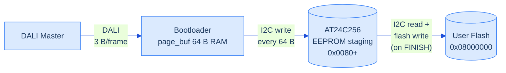

# DALI-bus Bootloader for CH32V003 — IEC 62386-105 Compatible

Firmware-over-DALI-bus bootloader using 32-bit forward frames as specified in IEC 62386-105:2020. Fits in the 1920-byte boot area. Receives firmware via the DALI bus protocol, stages it in an external I2C EEPROM, validates device identity via Block 0, then copies to internal flash.

**1,896 / 1,920 bytes (98.8%)** — interoperates with IEC 62386-105 compatible firmware-update masters.

> Trademark notice — see [root README](../README.md): *DALI*, *DALI-2* etc. are DiiA trademarks; this project is an independent IEC 62386 implementation, not DiiA-certified.

## How It Works

- 32-bit forward frame decoder at 1200 baud (IEC 62386-101, 7.4.3)
- Accepts IEC 62386-105 commands: START FW TRANSFER, BEGIN BLOCK, TRANSFER BLOCK DATA, FINISH FW UPDATE, RESTART FW, QUERY BLOCK FAULT, QUERY FW UPDATE RUNNING
- **Block 0 validation**: GTIN (6 bytes) and Device key byte 0 (EVG mode ID) are compared against values stored in EEPROM by the firmware. Mismatch → QUERY BLOCK FAULT returns YES → master aborts
- **Fletcher-16 integrity check**: Block 0 also carries a 2-byte Fletcher-16 of the firmware payload at positions `0x2C`/`0x2D`. The bootloader accumulates `fa`/`fb` over every received Block 1 firmware byte and compares against the expected value at FINISH. Mismatch → flash commit aborted, master sees BLOCK FAULT
- Block 1..n firmware data is extracted from the block structure (headers and trailing CRC skipped) and streamed to the I2C EEPROM staging area
- On FINISH FW UPDATE (no fault): EEPROM contents are copied to internal flash, then device auto-reboots into the new firmware (silent on the bus — master sees timeout)
- On FINISH FW UPDATE (Fletcher mismatch): BL sends `0xFF` (= YES, "not done") as an explicit fault signal, then auto-resumes the **existing** user firmware that's still untouched in flash. Master can detect the explicit fault and report `UPDATE FAILED` to the user. Added 2026-05-17 to eliminate the previous failure mode where the EVG appeared "dead" until manual power-cycle.
- Other DALI devices on the bus are **not affected** — 32-bit frames are silently ignored per IEC 62386-101

## Speed

3 firmware bytes per 32-bit frame (vs 1 byte per 2 frames in the original bootloader). Expected transfer time for 10 KB firmware: **~2.5 minutes**.

## Boot Entry

Two ways to enter bootloader mode:

1. **Software**: Firmware receives START FW TRANSFER (32-bit, device-addressed), responds YES, sets `FLASH->STATR` bit 14 via the WCH `SystemReset_StartMode` sequence, and resets. The bootloader checks bit 14 on startup and enters update mode if set. Bit 14 is cleared immediately after reading (one-shot).
2. **Hardware**: Hold **PA1 low** during reset. The bootloader enters update mode and responds YES to any subsequent START FW TRANSFER from the master.

If neither condition is met, the bootloader jumps directly to user code.

**Note**: RAM magic words do NOT survive PFIC system reset on CH32V003. The `FLASH->STATR` bit 14 approach is used.

## Protocol


### Phase 1 — Enter Bootloader (handled by firmware)

| Frame | Direction | Description |
|-------|-----------|-------------|
| `[addr] [0xFB] [0x05] [0x00]` | Master → Device | QUERY FW UPDATE FEATURES (firmware responds 0x00) |
| `[addr] [0xFB] [0x00] [0x00]` ×2 | Master → Device | START FW TRANSFER (config repeat) |
| `0xFF` | Device → Master | YES — firmware ACKs, then resets into bootloader |

### Phase 2 — Block 0 Validation (handled by bootloader)

| Frame | Direction | Description |
|-------|-----------|-------------|
| `[0xCB] [0x00] [0x00] [0x00]` | Master → Bootloader | BEGIN BLOCK 0 (info block) |
| `[0xBD] [d0] [d1] [d2]` ×21 | Master → Bootloader | Block 0 data — GTIN at pos 5-10, Device key at pos 0x2B validated against EEPROM; Fletcher-16 expected stored from pos 0x2C/0x2D |
| `[0xBF] [0xFB] [0x08] [0x00]` | Master → Bootloader | QUERY BLOCK FAULT — silence = OK, YES = GTIN/mode mismatch |

### Phase 3 — Firmware Data Transfer

| Frame | Direction | Description |
|-------|-----------|-------------|
| `[0xCB] [blk_h] [blk_m] [blk_l]` | Master → Bootloader | BEGIN BLOCK 1..n (resets `blockFault` and Fletcher accumulator) |
| `[0xBD] [d0] [d1] [d2]` | Master → Bootloader | TRANSFER BLOCK DATA — 3 firmware bytes per frame, no response. Each firmware byte feeds `fa += d; fb += fa;` |
| `[0xBF] [0xFB] [0x08] [0x00]` | Master → Bootloader | QUERY BLOCK FAULT — silence = no fault |

Block 1..n: bytes 0-1 = data size (s), bytes 2-14 = header (skipped), bytes 15..s+14 = firmware data (stored to EEPROM staging area at 0x0080+), bytes s+15..s+16 = trailing CRC (skipped, bootloader uses Fletcher-16 over the firmware payload instead).

### Phase 4 — Commit

| Frame | Direction | Description |
|-------|-----------|-------------|
| `[0xBF] [0xFB] [0x03] [0x00]` ×2 | Master → Bootloader | FINISH FW UPDATE (config repeat) — bootloader compares accumulated `fa`/`fb` against expected. If both match and no prior fault: erases user-flash pages, copies EEPROM → flash, auto-reboots. Mismatch sets BLOCK FAULT and aborts. |
| `[addr] [0xFB] [0x01] [0x00]` | Master → Bootloader | RESTART FW (if needed) — responds YES, reboots |

## Firmware Storage Path

CH32V003 flash cannot be erased and written while code is executing from the same flash region. The bootloader sits in the boot area at `0x1FFFF000`, so it can write to user-flash at `0x08000000` — but the incoming firmware bytes have to be buffered somewhere while we're still receiving them. RAM is only 2 KB, far too small for a 10 KB firmware image. Solution: stage everything in the external **AT24C256 I2C EEPROM** (32 KB), then commit to user-flash in one pass at the end.



**Power-loss robustness.** Up until `FINISH FW UPDATE` succeeds and `copy_eeprom_to_flash()` starts erasing pages, user flash is untouched — losing power simply means the existing firmware boots normally on the next power cycle and the master can retry. The erase + copy phase is **not** atomic: a power loss during this window can leave user flash partially erased and the device unbootable, requiring re-flashing via WCH-Link. Master operations (sending Block 0 + Block 1 + final QUERY BLOCK FAULT) finish before any flash erase, so the at-risk window is limited to the final ~1-2 seconds of the update.

**Why Fletcher-16 instead of full CRC.** Fletcher fits in ~12 bytes of code (two `uint8_t` accumulators with rolling sum-of-sums) and matches CRC-16-CCITT in detection probability for the random-error and burst-error patterns seen on a DALI bus. Real CRC-16/32 with table-free implementation costs ~50-70 bytes — too expensive for the 1920-byte boot area when it has to coexist with the existing GTIN/mode validation, EEPROM driver, flash programming, and Manchester RX/TX.

## EEPROM Layout

The AT24C256 EEPROM serves as both persistent config storage and firmware staging area. Layout is shared between firmware and bootloader (defined in `Firmware/src/eeprom/eeprom_layout.h`).

```
AT24C256 (32 KB = 0x0000–0x7FFF)
├── 0x0000–0x003F  Device identity (64 B)
│   ├── 0x0000  magic (4 B, "DALI" = 0x44414C49)
│   ├── 0x0004  GTIN (6 B, MSB first)
│   ├── 0x000A  EVG mode ID (1 B)
│   ├── 0x000B  HW version major/minor (2 B)
│   ├── 0x000D  FW version major/minor (2 B)
│   └── 0x000F  short_address (1 B)
├── 0x0040–0x007F  DALI config (64 B, same struct as dali_nvm_t)
└── 0x0080–0x7FFF  Firmware staging area (32,640 B)
```

The identity block is written by the firmware at every boot. The bootloader reads it to:
1. Determine the device's DALI short address (for START FW TRANSFER addressing)
2. Validate Block 0 GTIN and Device key against the device's identity

## Pin Usage

| Pin | Function | Notes |
|-----|----------|-------|
| PC1 | I2C SDA | AT24C256 EEPROM |
| PC2 | I2C SCL | AT24C256 EEPROM |
| PC3 | DALI RX | Input, floating (from PHY RX_OUT) |
| PC4 | DALI TX | Output, push-pull (to PHY TX_IN) |
| PA1 | Boot button | Input, pull-up, active low at reset |

## Prerequisites

The CH32V003 option bytes must be configured to boot from the bootloader area. Flash `configurebootloader.bin` once per chip using a WCH-LinkE programmer:

```
wlink flash configurebootloader.bin
```

## Testing & End-to-End Verification

The full chain — KNX bus → Gateway → DALI bus → bootloader → I2C EEPROM staging → user-flash commit → reboot — can be exercised and verified independently.


Brief recipe of the actual run that proved every step:

 - Pushed the new `firmware.bin` over DALI. The Uploader computes Fletcher-16 once on the host and embeds it in Block 0, then transfers ~3 600 BLOCK_DATA frames in ~2.5 minutes.
 - Flashed firmware came online (verified via boot-banner `Build:` timestamp on UART).
 - Dumped AT24C256 over UART, checked against the FW-Binary byte-for-byte. All ~11 KB firmware bytes matched, trailing region clean.

### Driving an update from a host PC

The `EVG-Updater` C# application is the canonical update client. It implements the full IEC 62386-105 sequence and pushes a `firmware.bin` over the gateway WebSocket API:

1. Pre-computes Fletcher-16 over the firmware payload and embeds it in Block 0 at positions `0x2C` / `0x2D`
2. Sends START FW TRANSFER → Block 0 (with GTIN, mode, Fletcher-expected) → polls QUERY BLOCK FAULT (catches GTIN/mode mismatch before pumping ~11 KB of payload) → Block 1 firmware bytes → FINISH FW UPDATE
3. Checks FINISH response — `0xFF` = explicit Fletcher fault from BL (commit aborted, EVG auto-resumed previous FW), `null`/timeout = success (EVG silently rebooted into new FW)

Mid-transfer `QUERY BLOCK FAULT` polls were removed in 2026-05-17: structurally they could only catch Block-0 faults (which are checked once before Block 1 starts), since the BL's `blockFault` flag is cleared by BEGIN BLOCK 1 and only updated again inside the FINISH handler. See [[evg-bootloader-fault-semantics]] in the agent memory for the full reasoning.

The Python reference implementation `Debug_Helpers/DALI_Bootloader_full_update.py` is kept for protocol experiments / regression checks; not the routine update path.

## Build

Requires PlatformIO's RISC-V toolchain (`riscv-wch-elf-gcc`). All dependencies (`ch32v003fun.h`, `libgcc.a`) are included in the `ch32v003fun/` subfolder.

Double-click `build.bat` or run from command line.

## Flash

```
wlink flash --address 0x1FFFF000 dali_bootloader.bin
```

## Resource Usage

| Resource | Value |
|----------|-------|
| Flash | **1,896 B / 1,920 B (98.8%)** (as of 2026-05-17, includes Fletcher-16 + auto-resume-on-fault) |
| RAM | ~150 B (stack + variables) |
| I2C | I2C1, 100 kHz, AT24C256 at address 0x50 |

## Important: TX Polarity (PHY Mode)

With a DALI PHY transceiver: **TX HIGH = bus active (mark), TX LOW = bus idle (space)**. The bootloader must initialize PC4 to LOW (idle) and use the correct Manchester encoding:
- `tx_active()` = GPIO HIGH = PHY pulls bus to 0V
- `tx_idle()` = GPIO LOW = PHY releases bus

The firmware's `dali_phy.c` uses the same convention (`BSHR` = active, `BCR` = idle).

## Files

| File | Description |
|------|-------------|
| `dali_bootloader.c` | Main bootloader source |
| `startup.S` | Minimal startup (vector table, stack init, BSS zero) |
| `funconfig.h` | ch32v003fun config |
| `build.bat` | Build script using PlatformIO toolchain |
| `bootloader.ld` | Linker script (boot area: 0x00000000, 1920 bytes) |
| `ch32v003fun/` | Dependencies: `ch32v003fun.h` + `libgcc.a` |
| `dali_bootloader.bin` | Pre-built binary (1,896 bytes) |
| `configurebootloader.bin` | Option bytes configurator (run once per chip) |
| `flash.bat` | Flash bootloader to boot area via WCH-LinkE |
| `bootloader_protocol.mmd` | Protocol sequence diagram (Mermaid source) |
| `bootloader_protocol.png` | Rendered protocol diagram |
