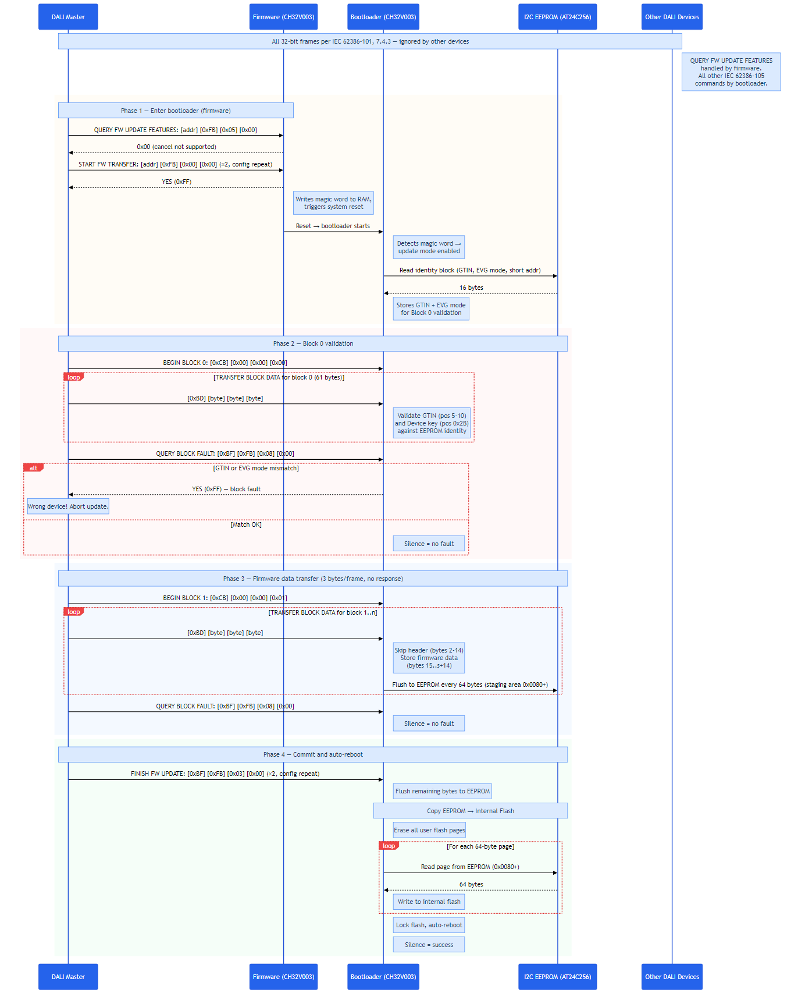

# DALI Bootloader for CH32V003 — IEC 62386-105 Compatible

Firmware-over-DALI-bus bootloader using 32-bit forward frames as specified in IEC 62386-105:2020. Fits in the 1920-byte boot area. Receives firmware via standard DALI protocol, stages it in an external I2C EEPROM, validates device identity via Block 0, then copies to internal flash.

**~1876 / 1920 bytes (97.7%)** — compatible with standard DALI firmware update masters.

## How It Works

- 32-bit forward frame decoder at 1200 baud (IEC 62386-101, 7.4.3)
- Accepts IEC 62386-105 commands: START FW TRANSFER, BEGIN BLOCK, TRANSFER BLOCK DATA, FINISH FW UPDATE, RESTART FW, QUERY BLOCK FAULT, QUERY FW UPDATE RUNNING
- **Block 0 validation**: GTIN (6 bytes) and Device key byte 0 (EVG mode ID) are compared against values stored in EEPROM by the firmware. Mismatch → QUERY BLOCK FAULT returns YES → master aborts
- Block 1..n firmware data is extracted from the block structure (headers and CRCs skipped) and streamed to the I2C EEPROM staging area
- On FINISH FW UPDATE (if no fault): EEPROM contents are copied to internal flash, then device auto-reboots
- Other DALI devices on the bus are **not affected** — 32-bit frames are silently ignored per IEC 62386-101

## Speed

3 firmware bytes per 32-bit frame (vs 1 byte per 2 frames in the original bootloader). Expected transfer time for 10 KB firmware: **~2.5 minutes** (vs ~11 minutes with the original protocol).

## Boot Entry

Two ways to enter bootloader mode:

1. **Software**: Firmware receives START FW TRANSFER (32-bit, device-addressed), responds YES, sets `FLASH->STATR` bit 14 via the WCH `SystemReset_StartMode` sequence, and resets. The bootloader checks bit 14 on startup and enters update mode if set. Bit 14 is cleared immediately after reading (one-shot).
2. **Hardware**: Hold **PA1 low** during reset. The bootloader enters update mode and responds YES to any subsequent START FW TRANSFER from the master.

If neither condition is met, the bootloader jumps directly to user code.

**Note**: RAM magic words do NOT survive PFIC system reset on CH32V003. The `FLASH->STATR` bit 14 approach is used instead (same mechanism as the LED-Snowflake USB bootloader). Requires `configurebootloader.bin` option bytes to be set for boot-from-bootloader mode.

## Protocol



### Phase 1 — Enter Bootloader (handled by firmware)

| Frame | Direction | Description |
|-------|-----------|-------------|
| `[addr] [0xFB] [0x05] [0x00]` | Master → Device | QUERY FW UPDATE FEATURES (firmware responds 0x00) |
| `[addr] [0xFB] [0x00] [0x00]` ×2 | Master → Device | START FW TRANSFER (config repeat) |
| `0xFF` | Device → Master | YES — firmware ACKs, then resets into bootloader |

### Phase 2 — Block 0 Validation (handled by bootloader)

| Frame | Direction | Description |
|-------|-----------|-------------|
| `[0xCB] [0x00] [0x00] [0x00]` | Master → Bootloader | BEGIN BLOCK 0 (info block) |
| `[0xBD] [d0] [d1] [d2]` ×21 | Master → Bootloader | Block 0 data — GTIN at pos 5-10, Device key at pos 0x2B validated against EEPROM |
| `[0xBF] [0xFB] [0x08] [0x00]` | Master → Bootloader | QUERY BLOCK FAULT — silence = OK, YES = GTIN/mode mismatch |

### Phase 3 — Firmware Data Transfer

| Frame | Direction | Description |
|-------|-----------|-------------|
| `[0xCB] [blk_h] [blk_m] [blk_l]` | Master → Bootloader | BEGIN BLOCK 1..n |
| `[0xBD] [d0] [d1] [d2]` | Master → Bootloader | TRANSFER BLOCK DATA — 3 firmware bytes per frame, no response |
| `[0xBF] [0xFB] [0x08] [0x00]` | Master → Bootloader | QUERY BLOCK FAULT — silence = no fault |

Block 1..n: bytes 0-1 = data size (s), bytes 2-14 = header (skipped), bytes 15..s+14 = firmware data (stored to EEPROM staging area at 0x0080+), bytes s+15..s+16 = trailing CRC (skipped).

### Phase 4 — Commit

| Frame | Direction | Description |
|-------|-----------|-------------|
| `[0xBF] [0xFB] [0x03] [0x00]` ×2 | Master → Bootloader | FINISH FW UPDATE (config repeat) — if no fault: copies EEPROM → flash, auto-reboots |
| `[addr] [0xFB] [0x01] [0x00]` | Master → Bootloader | RESTART FW (if needed) — responds YES, reboots |

## EEPROM Layout

The AT24C256 EEPROM serves as both persistent config storage and firmware staging area. Layout is shared between firmware and bootloader (defined in `Firmware/src/eeprom/eeprom_layout.h`).

```
AT24C256 (32 KB = 0x0000–0x7FFF)
├── 0x0000–0x003F  Device identity (64 B)
│   ├── 0x0000  magic (4 B, "DALI" = 0x44414C49)
│   ├── 0x0004  GTIN (6 B, MSB first)
│   ├── 0x000A  EVG mode ID (1 B)
│   ├── 0x000B  HW version major/minor (2 B)
│   ├── 0x000D  FW version major/minor (2 B)
│   └── 0x000F  short_address (1 B)
├── 0x0040–0x007F  DALI config (64 B, same struct as dali_nvm_t)
└── 0x0080–0x7FFF  Firmware staging area (32,640 B)
```

The identity block is written by the firmware at every boot. The bootloader reads it to:
1. Determine the device's DALI short address (for START FW TRANSFER addressing)
2. Validate Block 0 GTIN and Device key against the device's identity

## Pin Usage

| Pin | Function | Notes |
|-----|----------|-------|
| PC1 | I2C SDA | AT24C256 EEPROM |
| PC2 | I2C SCL | AT24C256 EEPROM |
| PC3 | DALI RX | Input, floating (from PHY RX_OUT) |
| PC4 | DALI TX | Output, push-pull (to PHY TX_IN) |
| PA1 | Boot button | Input, pull-up, active low at reset |

## Prerequisites

The CH32V003 option bytes must be configured to boot from the bootloader area. Flash `configurebootloader.bin` once per chip using a WCH-LinkE programmer:

```
wlink flash configurebootloader.bin
```

## Build

Requires PlatformIO's RISC-V toolchain (`riscv-wch-elf-gcc`). All dependencies (`ch32v003fun.h`, `libgcc.a`) are included in the `ch32v003fun/` subfolder.

Double-click `build.bat` or run from command line.

## Flash

```
wlink flash --address 0x1FFFF000 dali_bootloader.bin
```

## Resource Usage

| Resource | Value |
|----------|-------|
| Flash | 1,908 B / 1,920 B (99.4%) |
| RAM | ~150 B (stack + variables) |
| I2C | I2C1, 100 kHz, AT24C256 at address 0x50 |

## Important: TX Polarity (PHY Mode)

With a DALI PHY transceiver: **TX HIGH = bus active (mark), TX LOW = bus idle (space)**. The bootloader must initialize PC4 to LOW (idle) and use the correct Manchester encoding:
- `tx_active()` = GPIO HIGH = PHY pulls bus to 0V
- `tx_idle()` = GPIO LOW = PHY releases bus

The firmware's `dali_phy.c` uses the same convention (`BSHR` = active, `BCR` = idle).

## Debug Bootloader

`dali_bootloader_debug.c` is a diagnostic version with UART output (PD5, 115200 baud at 24 MHz HSI). It implements the full IEC 62386-105 command dispatch but **discards firmware data** instead of writing to EEPROM. Useful for:

- Verifying the DALI frame RX/TX round-trip
- Testing the update protocol from a master (gateway/C# app)
- Debugging boot entry, Block 0 validation, and command flow

Build with the same `build.bat` toolchain, replacing the `.c` file:
```
riscv-wch-elf-gcc ... dali_bootloader_debug.c ...
```

UART output key:
- `STAY` / `EXIT` — boot decision (FLASH->STATR bit 14)
- `EE ok` / `EE!` — EEPROM identity read result
- `B0`, `B1` — BEGIN BLOCK received
- `.` / `!` — QUERY BLOCK FAULT response (ok / fault)
- `OK <n>B` — FINISH FW UPDATE, n firmware bytes received
- `S` — START FW TRANSFER → YES
- `R` — RESTART FW → reboot

## Comparison with Original Bootloader

| Feature | Original (DALI_Bootloader) | IEC 62386-105 (this) |
|---------|---------------------------|----------------------|
| Frame format | 16-bit standard | 32-bit reserved forward |
| Data rate | 1 byte per 2 frames | 3 bytes per frame |
| Transfer time (10 KB) | ~11 min | ~2.5 min |
| Protocol | Vendor-specific (cmd 131-135) | IEC 62386-105 standard |
| Storage | EEPROM staging → flash | EEPROM staging → flash |
| Block 0 validation | None | GTIN + EVG mode ID |
| Flash safety | Flash untouched until commit | Flash untouched until commit |
| Standard master compatible | No (custom tool only) | Yes |
| Boot size | 1,616 B (84%) | 1,876 B (97.7%) |

## Files

| File | Description |
|------|-------------|
| `dali_bootloader_105.c` | Main bootloader source |
| `startup.S` | Minimal startup (vector table, stack init, BSS zero) |
| `funconfig.h` | ch32v003fun config |
| `build.bat` | Build script using PlatformIO toolchain |
| `bootloader.ld` | Linker script (boot area: 0x00000000, 1920 bytes) |
| `ch32v003fun/` | Dependencies: `ch32v003fun.h` + `libgcc.a` |
| `dali_bootloader.bin` | Pre-built binary (~1876 bytes) |
| `configurebootloader.bin` | Option bytes configurator (run once per chip) |
| `flash.bat` | Flash bootloader to boot area via WCH-LinkE |
| `bootloader_protocol.mmd` | Protocol sequence diagram (Mermaid source) |
| `bootloader_protocol.png` | Rendered protocol diagram |
