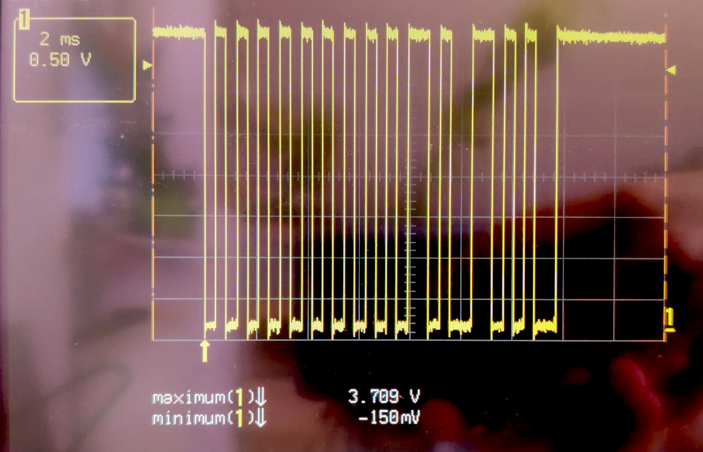

# Hardware

PCB designs for the OpenDALI_EVG project.

> Trademark notice — see [root README](../README.md): *DALI*, *DALI-2* etc. are DiiA trademarks; this project is an independent IEC 62386 implementation, not DiiA-certified.

## Boards

### Controller

The DALI PHY and microcontroller board. Handles all DALI-bus communication (IEC 62386-101/102 compatible), protocol processing, and generates the digital PWM/LED control signals. Built around the CH32V003F4U6 RISC-V microcontroller (20-pin QFN, 48 MHz, 16 KB Flash, 2 KB RAM).

The PHY transceiver converts between the DALI bus voltage levels (0/16V) and the MCU's 3.3V logic. See `Simulationen/` for LTspice reference designs (isolated and non-isolated variants).

#### Pin Assignment, CH32V003F4U6

| Pin | Function | Direction | Peripheral | Notes |
|-----|----------|-----------|------------|-------|
| PA1 | Boot button | Input | GPIO | Active low at reset → enter USB bootloader |
| PA2 | PSU Control | Output | GPIO | HIGH = external PSU on, LOW = off |
| PC0 | LED3 / Blue PWM | Output | TIM1_CH3 | 20 kHz, 2400-step (11.2 bit) |
| PC1 | I2C SDA | Bidir | I2C1 | Reserved for AT24C256C EEPROM |
| PC2 | I2C SCL | Output | I2C1 | Reserved for AT24C256C EEPROM |
| PC3 | DALI RX | Input | EXTI3 | From PHY RX_OUT, both-edge interrupt |
| PC4 | DALI TX | Output | GPIO | To PHY TX_IN, Manchester encode |
| PC5 | *(spare)* | — | — | Free GPIO for future use |
| PC6 | LED1 / Red PWM **or** WS2812 data | Output | TIM1_CH1 / SPI1_MOSI | Dual-use: PWM in analog modes, SPI+DMA in digital LED modes |
| PC7 | LED2 / Green PWM | Output | TIM1_CH2 | 20 kHz, 2400-step (11.2 bit) |
| PD0 | USB D+ Pull-Up | Output | GPIO | Directly driven by bootloader for USB enumeration |
| PD1 | SWDIO | Bidir | SWD | Single-wire debug (active during programming) |
| PD2 | USB D- | Bidir | GPIO (bit-bang) | USB Low-Speed, active only in bootloader |
| PD3 | LED4 / White PWM | Output | TIM1_CH4 | 20 kHz, 2400-step (11.2 bit) |
| PD4 | USB D+ | Bidir | GPIO (bit-bang) | USB Low-Speed, active only in bootloader |
| PD5 | Debug UART TX | Output | USART1_TX | 115200 baud, via WCH-LinkE bridge |
| PD6 | Debug UART RX | Input | USART1_RX | 115200 baud, available for debug input |
| PD7 | NRST | Input | Reset | Active low hardware reset |

**PWM channel mapping** (TIM1 Partial Remap 1, `AFIO_PCFR1_TIM1_REMAP = 01`):

| Channel | Pin | LED colour (RGBW mode) |
|---------|-----|----------------------|
| TIM1_CH1 | PC6 | Red (shared with WS2812 SPI1_MOSI) |
| TIM1_CH2 | PC7 | Green |
| TIM1_CH3 | PC0 | Blue |
| TIM1_CH4 | PD3 | White |

**Digital LED output** (WS2812/SK6812 modes): SPI1_MOSI on PC6 at 3 MHz, DMA-driven. Same physical pin as TIM1_CH1 — selected at compile time via `EVG_MODE_xxx`.

**USB** (bootloader only): PD4 (D+), PD2 (D-), PD0 (DPU). Active only when boot button (PA1) is held low during reset. Do NOT connect USB while the EVG is on a DALI bus.

#### Hardware Validation

| Test | Target | Result | Evidence |
|------|--------|--------|----------|
| DALI RX Manchester waveform | Clean edges, correct timing | **PASS** — 3.7V swing, sharp edges, correct 1200 baud timing | See below |
| C24 voltage under sustained DALI traffic | > 12.5V | **PASS** — 14.40V min / 14.84V max (0.44V drop at 16V supply, 32 fps) | — |
| 3.3V rail stability under sustained traffic | Stable within CH32V003 spec (2.7–5.5V) | **PASS** — 3.42V min / 3.63V max (20mV additional ripple = noise only) | — |
| Current consumption (firmware running) | < 2 mA | **PASS** — 1.69 mA (169mV over 100R shunt) | — |

##### DALI RX Waveform

Oscilloscope capture of the raw Manchester-encoded signal on PC3 (DALI RX, via PHY transceiver) during a broadcast QUERY GEAR PRESENT (0xFF 0x91) frame. 0.50V/div, 2ms/div. Signal swings 0V to 3.7V with clean edges. The 16-bit forward frame (start bit + 16 data bits) is clearly visible with correct 1200 baud timing (~833µs per bit period).

##### C24 Voltage Stability

Voltage across C24 (DALI bus power supply decoupling) while rapidly sending DALI commands over an extended period. The voltage must remain above **12.5V** to ensure the circuit works at the lowest allowed DALI bus voltage (9.5V).

**Calculation:** The DC-DC converter requires a minimum of 5V input. The bridge rectifier drops ~1V (2 diodes). So C24 must stay above 6V for the converter to regulate. At the minimum DALI bus voltage of 9.5V, this allows a maximum voltage drop of 3.5V (9.5V - 6V). Our test supply runs at 16V, so the equivalent pass/fail threshold is 16V - 3.5V = **12.5V**. If C24 stays above 12.5V at 16V supply, it will stay above 6V at 9.5V supply. Note: this is a linear approximation — actual energy stored in C24 scales with V², so the real margin at 9.5V will be slightly worse. Best estimate for now until tested at actual minimum bus voltage.

**Measurement procedure:** DALI EVG firmware (RGBW mode) running on the target. An OpenKNX DALI gateway sent continuous broadcast QUERY GEAR PRESENT (0xFF 0x91) frames at maximum bus rate (~32 frames/sec, 25ms spacing per IEC 62386-101) for 5 seconds (~160 frames total). Oscilloscope probe on C24, DC coupling, 2V/div, 50ms/div timebase, min/max measurement enabled.

**Result (2026-05-02):**
- Bus supply voltage: 16V
- Maximum at C24: **14.84V**
- Minimum at C24: **14.40V**
- Voltage drop: **0.44V** (well within 3.5V budget)
- **PASS** — extrapolated minimum at 9.5V bus: ~9.06V (above 6V threshold)

**3.3V rail (after buck converter):**
- No traffic: 3.63V max / 3.44V min
- Under sustained traffic (32 fps): 3.63V max / 3.42V min
- **Stable** — only 20mV additional ripple under load. CH32V003 operating range is 2.7–5.5V, so 3.42V is well within spec.

##### Current Consumption

Total current draw of the Controller board with firmware running. Target: < 2 mA to stay within DALI bus power limits.

**Measurement (2026-05-02):** 100R shunt resistor in series with the supply. DALI EVG firmware (RGBW mode) running, bus idle, Bus Voltage 16V. Measured 169mV across the shunt → **1.69 mA**. Well within the 2 mA DALI bus power budget.

---

### LoadBoard 250W RGBW

LED driver and AC power switching board. Connects to the Controller via a 10-pin FFC cable (0.5 mm pitch) and provides:
- Mains switching for controlling the LED AC/DC Powersupply
- Power limits for the connected PSU: **max 1.2 A continuous** (without airflow), **max 3 A continuous** (with active airflow over the triac)
- 4-Channel PWM LED Driver (RGBW)

## Manufacturing

The Gerber files are ready for upload to any PCB manufacturer. The JLCPCB files (BOM + CPL) allow direct ordering with SMT assembly through [JLCPCB](https://jlcpcb.com/).
